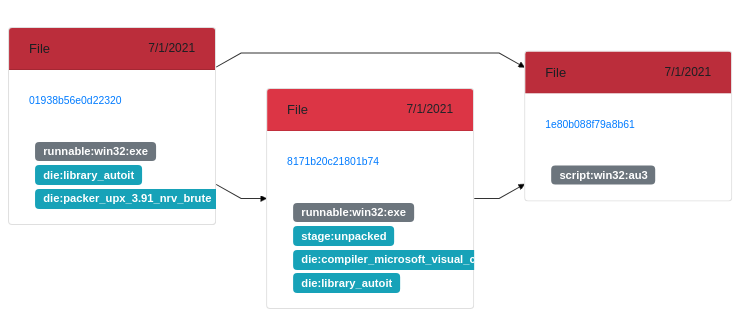

# karton-retdec-unpacker

This module leverages AVAST's [ReTDec](https://github.com/avast/retdec) unpacking module for processing UPX payloads.

## Consumes

```json
{
    "type": "sample",
    "stage": "recognized"
}
```

## Produces

```json
{   
    "type": "sample",
    "kind": "raw"
}
```
A custom tag _`stage:unpacked`_ will also be attached to unpacked children.

## Relations example

In the example below, the original sample (Aut2Exe + UPX) `01938b56e0d22320`, gets unpacked by _karton-retdec-unpacker_, generating child `8171b20c21801b74`. `1e80b088f79a8b61` is generated by [karton-autoit-ripper](https://github.com/CERT-Polska/karton-autoit-ripper)
<p align="center">
    
</p>

## Setup and configuration

### Dependencies

```bash
$ curl -s https://api.github.com/repos/avast/retdec/releases/latest | grep browser_download_url | awk -F"\":" '{print $2}' | tr -d "\"" | grep ubuntu | wget -q --show-progress -i -
# e.g. retdec-v4.0-ubuntu-64b.tar.xz
$ tar xvf retdec-v4.0-ubuntu-64b.tar.xz
$ cd retdec/bin
$ sudo ln -s retdec-unpacker.py /usr/local/bin/retdec-unpacker
```

### Module install

```bash
$ git clone https://github.com/raw-data/karton-retdec-unpacker/
$ cd karton-retdec-unpacker/
$ python3 -m venv .venv
$ source .venv/bin/active
$ pip install .

$ karton-retdec-unpacker
```